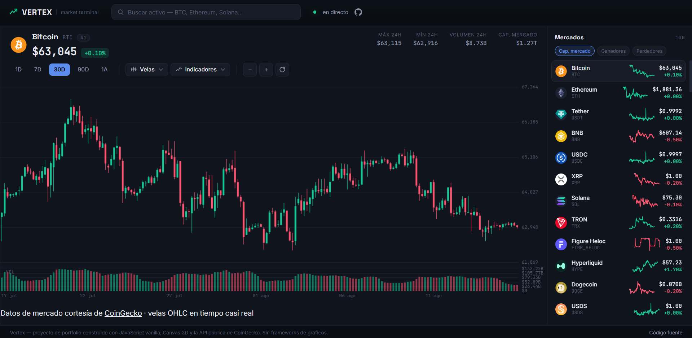

# Vertex — Crypto Market Terminal
Terminal de mercado de criptomonedas con estética de trading profesional (estilo TradingView), construido como pieza de portfolio. Todo el motor de gráficos está escrito a mano en **Canvas 2D con JavaScript vanilla** — sin librerías de charting de terceros.

**Demo en vivo:** https://Onyx2006.github.io/CryptoApp



## Características
- **Gráfico de velas real** dibujado desde cero sobre `<canvas>`, con 5 estilos intercambiables:
  velas japonesas, Heikin-Ashi, línea, área y barras OHLC.
- **Indicadores técnicos** calculados manualmente (sin librerías):
  - Media móvil simple (SMA 20)
  - Media móvil exponencial (EMA 50)
  - Bandas de Bollinger (20, 2σ)
  - RSI (14) en panel independiente
  - MACD (12, 26, 9) con histograma, en panel independiente
  - Volumen agregado por vela
- **Crosshair interactivo** sincronizado entre todos los paneles, con tooltip de OHLC y variación %.
- **Zoom (rueda del ratón o pellizco con dos dedos en táctil) y pan** (arrastrar) sobre el histórico
  de velas — arrastrar dentro del gráfico mueve las velas en horizontal y, a la vez, desplaza
  verticalmente el precio o indicador de ese panel (no solo izquierda/derecha, también arriba/abajo).
- **Escala de eje ajustable**: pincha y arrastra verticalmente sobre el eje derecho (donde aparecen
  los números) de cualquier panel —precio, volumen, RSI o MACD— para agrandar o comprimir esa escala.
  Arriba amplía, abajo aleja. Doble clic la restablece. Funciona igual con ratón y con el dedo.
- **Rendimiento histórico**: tarjetas con el % de cambio y un mini-gráfico para 1 semana, 1 mes,
  3 meses, 6 meses y 1 año, calculadas a partir del histórico de precios del activo seleccionado.
  Las tarjetas de 3 y 5 años se muestran como "N/D — requiere API de pago", ya que el histórico
  más allá de 365 días no está disponible en el plan público y gratuito de CoinGecko.
- **5 marcos temporales** para las velas: 1D, 7D, 30D, 90D, 1A.
- **Watchlist en vivo** de los 100 principales activos por capitalización, con sparklines de 7 días,
  ordenación (cap. mercado / ganadores / perdedores), buscador instantáneo, y que permanece visible
  (sticky) mientras se recorre el resto de la página.
- **Totalmente responsive**, con interacciones táctiles nativas (Pointer Events) para pan, zoom,
  pellizco y ajuste de escala en móvil, foco de teclado visible y `prefers-reduced-motion` respetado.
- **Favicon propio** en SVG + PNG (velas alcista/bajista con la paleta de marca).

## Arquitectura
Tres archivos, sin build step ni dependencias de terceros en producción:

```
index.html   → estructura semántica de la interfaz
style.css    → sistema de diseño (tokens, layout, componentes)
script.js    → capa de datos + motor de gráficos + lógica de UI
```

`script.js` se organiza en módulos funcionales dentro del mismo archivo:
1. **Capa de API** — `fetch` con caché en memoria y cancelación de peticiones obsoletas mediante
   `AbortController` (si el usuario cambia de activo o de marco temporal antes de que la petición
   anterior termine, esta se cancela).
2. **Indicadores técnicos** — funciones puras (`sma`, `ema`, `bollinger`, `rsi`, `macd`) que operan
   sobre arrays de precios de cierre.
3. **Motor de gráficos** — funciones de dibujo por panel (`drawPricePane`, `drawVolumePane`,
   `drawRsiPane`, `drawMacdPane`) que comparten un mismo estado de vista (offset/zoom horizontal,
   y escala/offset vertical independiente por panel) para mantener sincronizado el eje temporal
   entre paneles a la vez que cada uno se puede reescalar y desplazar por separado.
4. **UI** — watchlist, buscador, toolbar de indicadores/velas/marcos temporales, y las tarjetas de
   rendimiento histórico (`computePerformancePeriods`, `renderPerformance`).

## API utilizada
[CoinGecko API pública](https://www.coingecko.com/api) — gratuita, sin necesidad de API key.
- `GET /coins/markets` — listado de mercados para la watchlist y el buscador.
- `GET /coins/{id}/ohlc` — velas OHLC para el gráfico principal.
- `GET /coins/{id}/market_chart` — serie de volumen, agregada por vela en el cliente.
- `GET /coins/{id}/market_chart?days=365` — histórico de precios (máximo permitido por el plan
  público y gratuito de CoinGecko), usado para calcular las tarjetas de rendimiento. Se pide una
  sola vez por activo seleccionado, no se repite al cambiar de marco temporal de las velas.
  Las tarjetas de 3A/5A quedan como "N/D" porque ese rango requiere un plan de pago
  (`days=max` o `days` > 365 responde 401 en la API pública).

## Tecnologías
- HTML5 semántico
- CSS3 (custom properties, grid, sin frameworks)
- JavaScript vanilla (ES2020+), Canvas 2D API
- Fetch API + AbortController
- CoinGecko API pública

## Créditos de datos
Datos de mercado cortesía de [CoinGecko](https://www.coingecko.com).